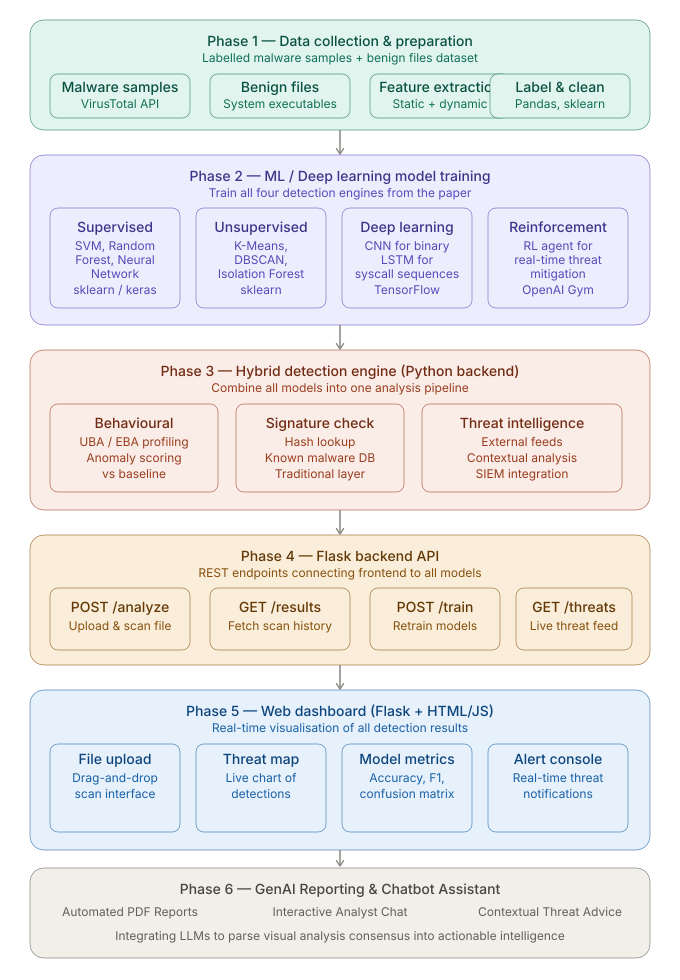
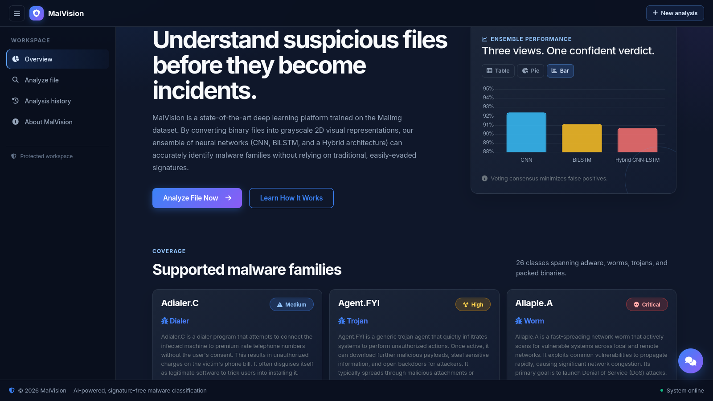
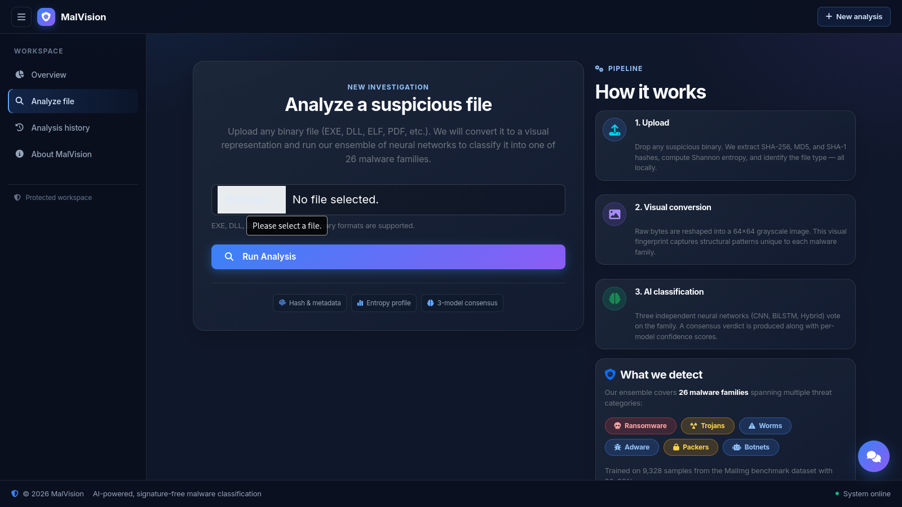
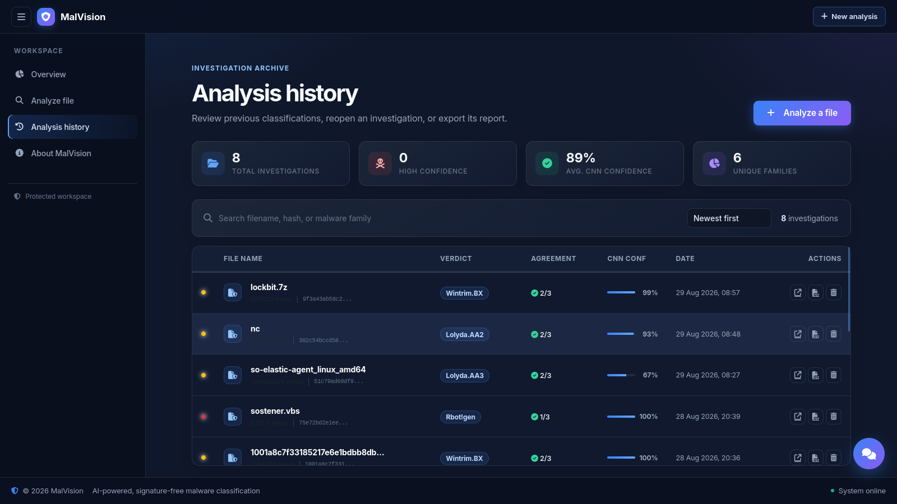
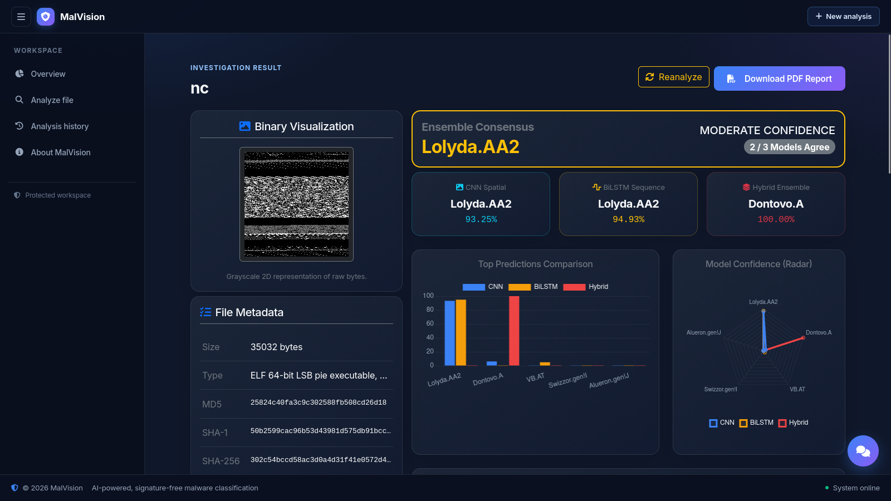
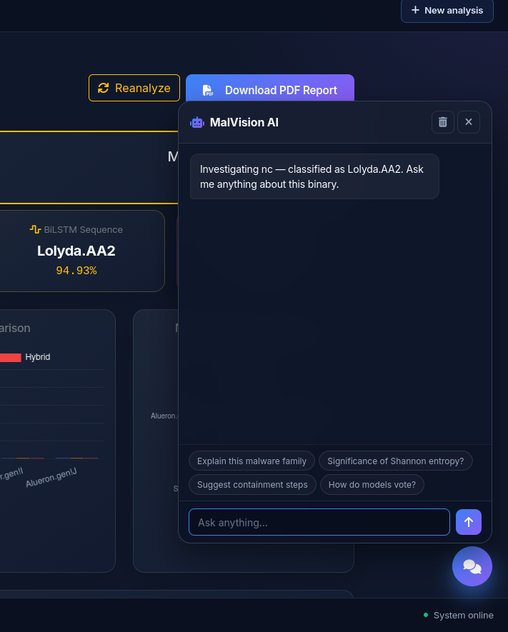

# MalVision — ML & AI-Integrated Malware Analyzer

**MalVision** is an enterprise-grade, end-to-end malware analysis platform that transforms raw binary executables into 2D visual representations and applies an ensemble of Deep Learning models (**CNN**, **BiLSTM**, and **Hybrid CNN-LSTM**) to classify malware into **26 distinct families**. 

The platform integrates advanced Shannon entropy calculation, cryptographic hashing (MD5, SHA-1, SHA-256, SHA-512), automated GenAI threat report generation, and an interactive AI Malware Analyst Assistant for real-time threat containment.

---

## System Architecture & End-to-End Pipeline

The platform follows a modular 6-phase architecture from raw sample ingestion to automated AI report generation:



### Core Analysis Phases:
1. **Data Collection & Binary Ingestion**: Receives raw binary samples, extracts cryptographic hashes, calculates byte-level Shannon entropy, and handles duplicate detection.
2. **Visual Feature Transformation (`bin2gray`)**: Converts arbitrary binary files into fixed-width 2D grayscale matrices (`224x224` resolution) based on file size thresholds.
3. **Ensemble Machine Learning Inference**: Runs three independent deep learning models concurrently:
   - **CNN (Spatial)**: Extracts visual structural patterns and byte distribution textures.
   - **RNN / BiLSTM (Sequential)**: Analyzes sequential byte transitions across rows.
   - **Hybrid CNN-LSTM**: Combines spatial convolution filters with recurrent sequential tracking.
4. **Consensus Voting & Confidence Evaluation**: Evaluates agreement across all 3 models to assign threat verdicts (*HIGH CONFIDENCE*, *MODERATE CONFIDENCE*, *LOW CONFIDENCE*).
5. **GenAI Threat Profiling**: Queries OpenAI GPT models to synthesize raw telemetry into structured Markdown threat assessments.
6. **Reporting & Interactive Assistance**: Renders interactive dynamic radar/bar comparison charts, produces downloadable PDF reports (using ReportLab & Matplotlib), and provides a live conversational AI Assistant.

---

## Platform Showcase & User Interface Gallery

All user interface screenshots captured directly from the live MalVision platform:

### 1. Main Dashboard & Malware Catalog
The primary hub lists all 26 supported malware family signatures, risk levels, threat types, and technical behavioral descriptions.



---

### 2. File Ingestion & Drag-and-Drop Analyzer
Upload interface with real-time duplicate MD5/SHA256 detection and conflict resolution options (reanalyze, open existing, replace binary).



---

### 3. Investigation Results & Visual Telemetry
Detailed breakdown of analyzed binaries displaying grayscale 2D visualization, Shannon entropy, file metadata, model consensus, and dynamic Chart.js probability comparison graphs.



---

### 4. Interactive AI Malware Analyst Assistant
An embedded AI Analyst trained on threat intelligence and binary telemetry. Analysts can query the chatbot for containment recommendations or append findings directly into the technical report.



---

### 5. Historical Scans & Audit Trail
Centralized log of all scanned samples with search, hash lookup, instant report re-download, and session management.



---

## Machine Learning Model Specifications

| Model Name | Architecture | Input Resolution / Shape | Specialization |
| :--- | :--- | :--- | :--- |
| **CNN_best.h5** | Deep Convolutional Neural Network | `(224, 224, 1)` | Spatial texture & byte matrix density pattern recognition |
| **RNN_BiLSTM_best.h5** | Bidirectional Long Short-Term Memory | `(224, 224)` | Long-range sequential byte transitions & instruction flow |
| **Hybrid_CNN_LSTM_best.h5** | Combined Conv2D + LSTM Layers | `(224, 224, 1)` | Unified spatial feature extraction with temporal sequence modeling |


---

## Quick Start & Installation Guide

### Prerequisites
- Linux OS (Ubuntu / Debian / Kali recommended)
- Python 3.10+ with virtual environment configured
- Trained model weights located in `~/combined2/AI1/malware_v2/models/`

### 1. Activate Environment
```bash
source ~/tf313_env/bin/activate
```

### 2. Configure OpenAI API Key
To enable the AI Malware Analyst Assistant and automated report generation, write your OpenAI API key to `~/openAI-key`:
```bash
echo "your_openai_api_key_here" > ~/openAI-key
```
Alternatively, export the key as an environment variable:
```bash
export OPENAI_API_KEY="your_openai_api_key_here"
```

### 3. Navigate to Codebase & Launch Server
```bash
cd ~/combined2/AI1/code_base
python app.py
```

Access the web interface at `http://127.0.0.1:5000` or `http://<your-ip>:5000`.


## Repository Structure

```
code_base/
├── app.py                      # Primary Flask application routing & WSGI entry point
├── analysis.py                 # File hashing, entropy calculation & ML prediction pipeline
├── bin2gray.py                 # Binary to 2D grayscale image transformation script
├── models_loader.py            # Dynamic model loader supporting standalone code_base execution
├── report_gen.py               # Technical PDF generator & OpenAI LLM integration
├── db.py                       # SQLAlchemy database models & SQLite configuration
├── malware_info.py             # Family malware intelligence database & threat metadata
├── images/                     # Directory for UI and architecture images
│   ├── architecture.svg        # Full system architecture vector diagram
│   ├── architecture.png        
│   ├── chatbot.png             
│   ├── dashboard.png           
│   ├── history.png             
│   └── results.png             
├── Last-day.pdf                # Project documentation & presentation summary
├── malware_v2/                 # Deep Learning models directory (.h5 weights)
│   └── models/
│       ├── CNN_best.h5
│       ├── RNN_BiLSTM_best.h5
│       └── Hybrid_CNN_LSTM_best.h5
├── screenshots/                # User platform screenshots gallery
│   ├── screenshot1.png         # Main Malware Catalog Dashboard
│   ├── screenshot2.png         # Drag-and-Drop Ingestion Analyzer
│   ├── screenshot3.png         # Investigation Results & Visual Telemetry
│   ├── screenshot4.png         # Interactive AI Analyst Chatbot
│   └── screenshot5.png         # Historical Scans Audit Trail
├── static/
│   ├── css/custom.css          # Dark-theme styling & responsive visual UI system
│   ├── favicon.ico             # MalVision shield favicon
│   └── uploads/                # Directory for uploaded binaries, PNGs, SVG diagrams & PDFs
└── templates/                  # Flask HTML templates
```
